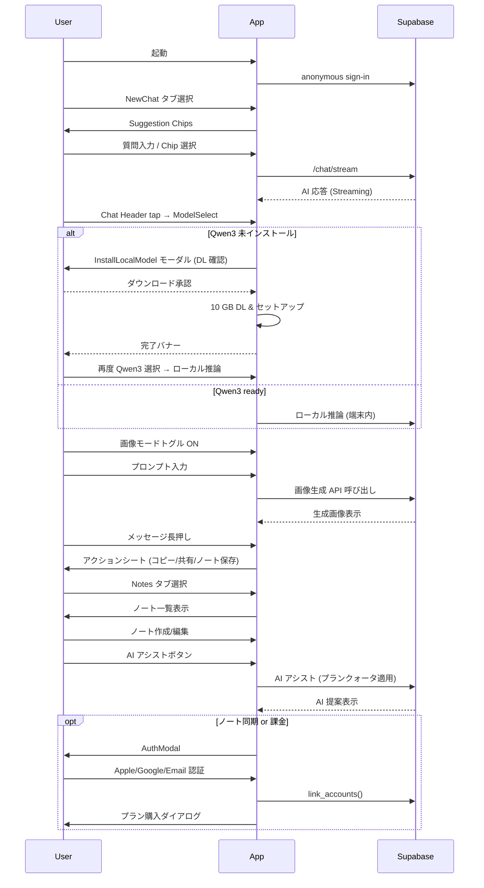

# 要件定義書

## 1. 目的・差別化ポイント
| 項目 | 内容 |
|------|------|
| **ミッション** | 「最安 × 高品質 × 広告ゼロ」を両立した"持ち歩けるAIチャットボットアプリ" |
| **主な特徴** | **UI/UX** : LINE ライク濃緑トーク UI、下部タブ **Chats / NewChat / Image / Notes / Settings**。 **AI** : OpenRouter Model-Routing + 端末ローカル Qwen3‑4B のハイブリッド。 **ノート連携** : 回答をワンタップで Markdown/Text ノートへ保存。AIアシスト付き編集機能。 **ローカルモデル導線** : ModelSelect に常時「Qwen3‑4B (ローカル)」。未インストール時はインストールモーダルへ誘導。 **画像生成** : SDXL（Workers AI）とDALL-E両方をサポート。チャット内で直接生成可能。 **ビジネス** : ゲスト利用 → 課金／同期時に認証。Free ¥0・Lite ¥980・Premium ¥3,980。 |
| **ターゲット** | 日本語ユーザー：学生・ビジネスパーソン・クリエイター |

---

## 2. 技術スタック
| 層 | 技術 | 備考 |
|----|------|------|
| **フロント** | Expo React Native / Expo Router / Tamagui | Bottom-Tab + Stack |
| **バックエンド** | Supabase (Auth, Postgres, Storage, Edge Functions) | RLS + Edge Functions |
| **LLM** | OpenRouter (クラウド) + mlc-llm / Qwen3‑4B ローカル | SSE Stream |
| **画像生成** | Cloudflare Workers AI (SDXL) + OpenAI DALL-E 3 | プラン別アクセス制限 |
| **課金** | StoreKit 2, Google Play Billing v6 | Edge Function レシート検証 |
| **デザイン** | Tailwind-like tokens | `primary #005E36` ほか |

---

## 3. ユースケースフロー

---

## 4. 料金プラン（更新版）
| プラン | 月額 | 半年/年間 | チャット／月 | 画像／日 | モデル | 備考 |
|--------|------|-----------|-------------|----------|--------|------|
| **Free** | ¥0 | - | **10k tokens** ≈ 20 msg | SDXL-25step ×5 | GPT-4o, 4o-mini, 4.1-mini & nano, DeepSeek V3, R1, **R1 Zero**, Gemini 2.5 Flash/Pro Exp, **Qwen3:4B (ローカル)** | GPT-4o & 4.1シリーズは合計で1 msg/日の制限あり |
| **Lite** | **¥980** | ¥5,600/6ヶ月 ¥9,800/12ヶ月 | **300k tokens** ≈ 600 msg | SDXL-25step ×10 | Free プランのモデル **+** o3, o4-mini, o4-mini-high, Gemini 2.5 Pro Preview | クォータ超過時は下位モデルへフォールバック |
| **Premium** | **¥3,980** | ¥23,800/6ヶ月 ¥39,800/12ヶ月 | **1.5M tokens** ≈ 3,000 msg | **DALL·E 3 ×5** + SDXL-25step ×50 | Lite プランのモデル **+** GPT-4.5 Preview, Claude 3.7 Sonnet & Sonnet-thinking | クォータ超過時は段階的にフォールバック |

---

## 5. 主な非機能要件
- **ローカルモデル DL** : Wi‑Fi 推奨、途中再開対応。
- **ストレージ** : インストール容量残 < 15GB 時は警告。
- **UI/UX** : ModelSelect バッジ → `未DL / DL中 / 検証中 / 使用可 / エラー` を色分け表示。
- **セキュリティ** : APIキーはサーバーサイドで管理し、ユーザーごとに発行。自動ローテーション機能あり。
- **クォータ管理** : プランごとの月次トークンバケツと日次画像バケツを実装。クォータ80%で警告表示、100%でフォールバックまたはアップグレード誘導。
- **UI一貫性** : 統一されたパディング、集中化されたスタイル、コンポーネントクリーンアップによる一貫したUI体験。
- **チャット編集** : チャット一覧で左スワイプ削除、タイトル右の編集アイコンでインライン編集。
- **チャットルーム** : 上部タイトル部分をタップしてインライン編集（2行まで表示可能）。
- **サムネ編集** : チャットごとにサムネ（アイコン）を設定可能。デフォルトアイコン20種＋端末画像から選択可。
- **新規チャット作成** : 新規チャット作成画面でモデル選択モーダルを開き、作成時に任意のモデルを指定可能。
- **画像生成** : チャット内で画像モードを切り替え可能。解像度、品質、モデル選択オプションあり。
- **メッセージアクション** : テキスト/画像メッセージに対するコピー、共有、ノート保存、画像保存機能。
- **ノート機能** : Markdown WYSIWYG エディタ、AIアシスト機能（プラン別クォータあり）、タグ管理（Lite+）。
