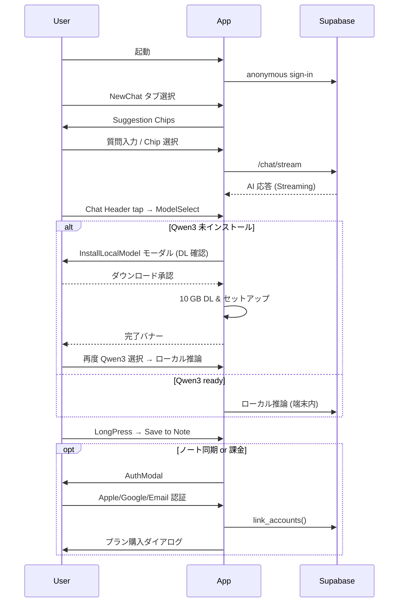

# 要件定義書

## 1. 目的・差別化ポイント
| 項目 | 内容 |
|------|------|
| **ミッション** | 「最安 × 高品質 × 広告ゼロ」を両立した“持ち歩けるAIチャットボットアプリ” |
| **主な特徴** | **UI/UX** : LINE ライク濃緑トーク UI、下部タブ **Chats / NewChat / Notes**。 **AI** : OpenRouter Model-Routing + 端末ローカル Qwen3‑4B のハイブリッド。 **ノート連携** : 回答をワンタップで Markdown/Text ノートへ保存。 **ローカルモデル導線** : ModelSelect に常時「Qwen3‑4B (ローカル)」。未インストール時はインストールモーダルへ誘導。 **ビジネス** : ゲスト利用 → 課金／同期時に認証。Lite ¥780・Heavy ¥1980。 |
| **ターゲット** | 日本語ユーザー：学生・ビジネスパーソン・クリエイター |

---

## 2. 技術スタック
| 層 | 技術 | 備考 |
|----|------|------|
| **フロント** | Expo React Native / Expo Router / Tamagui | Bottom-Tab + Stack |
| **バックエンド** | Supabase (Auth, Postgres, Storage, Edge Functions) | RLS + Edge Functions |
| **LLM** | OpenRouter (クラウド) + mlc-llm / Qwen3‑4B ローカル | SSE Stream |
| **課金** | StoreKit 2, Google Play Billing v6 | Edge Function レシート検証 |
| **デザイン** | Tailwind-like tokens | `primary #005E36` ほか |

---

## 3. ユースケースフロー（ローカルモデル導線を追加）

---

## 4. 料金プラン（変更なし）
| プラン | 月額 | チャット／月 | 画像／日 | モデル | 備考 |
|--------|------|-------------|----------|--------|------|
| Free | ¥0 | 50 msg / 10k tok | 5 | 4o-mini / 4.1-mini / 4.1-nano / R1 + Qwen3:4B (DL可) | Qwen3 要 DL |
| Lite | ¥780 | 500 msg / 150k tok | 20 | + GPT‑4o / 4.1 | 超過は 4o-mini |
| Heavy | ¥1980 | 5000 msg / 1.5M tok* | 75 | + GPT‑4.5 / V3 / Gemini 1.5 / Claude Sonnet | *超過後 4o‑mini / 4.1-mini / 4.1 /nano にフォールバック |

---

## 5. 主な非機能要件（追記）
- **ローカルモデル DL** : Wi‑Fi 推奨、途中再開対応。
- **ストレージ** : インストール容量残 < 15GB 時は警告。
- **UI/UX** : ModelSelect バッジ → `未 / DL中 / 準備完了` を色分け表示。
- **セキュリティ** : 非公開apiキーはサーバーサイドの環境変数にセットし、supabaseのRLSを設定。その他、サーバーサイド関数によって勝手にDBを破壊されたり、ユーザーデータが流出することのないように気をつける。
