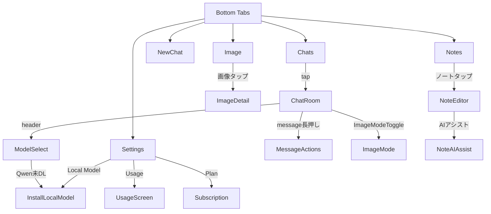

# 画面設計書（LINE風 + 機能強化版）

## カラーパレット & テーマ
(primary `#005E36`, primary-light `#00C26A`, accent-blue `#007AFF`, delete-red `#FF3B30`, warning-yellow `#FFCC00`)

---

## 1. 画面一覧
| ID | 画面 | コンポーネント・要点 |
|----|------|--------------------|
| Splash | ロゴ＋Lottie | 2 s |
| Chats | トーク一覧 FlatList / 未読バッジ / ギア設定 | 長押し編集 + 左スワイプ削除 |
| Chats | トーク一覧 FlatList / 未読バッジ / ギア設定\n**サムネ編集・タイトル編集（インライン）** | サムネタップでアイコン選択モーダル、タイトル右にえんぴつアイコン |
| NewChat | Suggestion Chips + Input | モデル名タップでモデル選択モーダル |
| Image | Masonry Gallery + 生成UI | 解像度/品質/モデル選択 |
| Notes | NoteList / Editor | MD WYSIWYG + AIアシスト |
| ChatRoom | Header: Model▼ + Avatar<br>MessageList + Input + ImageModeToggle | Header tap → ModelSelect |
| ChatRoom | Header: タイトル部分タップでインライン編集（2行まで表示） | 編集モード時はTextInput＋確定/キャンセル |
| ModelSelect (Modal) | モデル RadioList + **Qwen3 StateBadge** | タップで選択／未DLなら InstallModal |
| InstallLocalModel (Modal) | Qwen3 DL 確認 → ProgressBar | 完了バナー |
| ImageGen (Modal) | Prompt / Size / Quality / Model / Generate | プラン別オプション |
| MessageActions (ActionSheet) | コピー / ノートに保存 / 共有 / 画像保存 | メッセージ長押しで表示 |
| Settings | Profile / Theme / Plan / **Usage** / Local Model 管理 | 使用量表示、DL・削除 |
| Settings > Usage | トークン使用量 / 画像生成数 / ノートAIアシスト回数 | プログレスバー表示 |
| Subscription | プランカード・購入（月額/半年/年間） | Free/Lite/Premium |
| PayWall | 上限→課金誘導 | クォータ超過時表示 |
| AuthModal | Apple/Google/Email OTP | |
| DeleteConfirm (Modal) | 削除確認ダイアログ | 「このチャットを削除しますか？」 |
| QuotaWarning (Banner) | クォータ警告バナー | 残り20%で表示 |
| NoteEditor | Markdown WYSIWYG + AIアシスト | スパークルボタンでAIドロワー |
| NoteAIAssist (Drawer) | チャットUI + モデル選択 | プラン別クォータ適用 |
| TagOrganizer (Modal) | タグ一覧 + 編集 | Lite+のみ |

---

## 2. ModelSelect 詳細 UI
```
Qwen3:4B (ローカル)   [⚪️ 未DL]  ▸
```
- バッジ: ⚪️未DL / 🔄DL中 / 🔍検証中 / 🟢使用可 / 🔴エラー
- 未DLタップ → InstallLocalModel

---

## 3. InstallLocalModel フロー
```
┌────────────────────────────┐
│ Qwen 3‑4B をインストール？  │
│ サイズ: 10GB / Wi‑Fi 推奨 │
│ [キャンセル] [ダウンロード] │
│ ▓▓▓░░ 45 %                 │
└────────────────────────────┘
```

---

## 4. 画像生成UI
```
┌────────────────────────────┐
│ 画像生成                    │
│ SDXL: 残り 5/5回            │
│ [テキスト入力エリア]        │
│                            │
│ モデル:                     │
│ [SDXL] [DALL-E]            │
│                            │
│ サイズ:                     │
│ [512×512] [768×768] [1024×1024] │
│                            │
│ 品質:                       │
│ [標準] [高品質]             │
│                            │
│ [生成]                      │
└────────────────────────────┘
```

---

## 5. メッセージアクション
```
┌────────────────────────────┐
│ [コピー]                    │
│ [ノートに保存]              │
│ [共有]                      │
│ [画像を保存]                │ ← 画像メッセージのみ
│ [キャンセル]                │
└────────────────────────────┘
```

---

## 6. 使用量表示
```
┌────────────────────────────┐
│ トークン使用量              │
│ [███████░░░] 70% (210k/300k)│
│                            │
│ 画像生成                    │
│ SDXL: [██░░░░░░] 2/10       │
│ DALL-E: [░░░░░] 0/1         │
│                            │
│ AIアシスト                  │
│ [███░░░░░] 6/20             │
└────────────────────────────┘
```

---

## 7. クォータ警告バナー
```
┌────────────────────────────┐
│ ⚠️ トークン残りわずか (20%) │
│ [詳細] [閉じる]             │
└────────────────────────────┘
```

---

## 8. ナビゲーション


## チャット編集UI例
```
┌────────────────────────────┐
│ 🟢 [AI相談]   ✏️           │ ← タイトル右に編集アイコン
│ こんにちは！                │
│                            │
│ 🖼️ サムネタップで変更       │
└────────────────────────────┘
```
サムネタップ → アイコン選択モーダル（デフォルト20種＋画像選択）

## チャットルーム画面
```
┌────────────────────────────┐
│ ←  [タイトル（2行まで）] ✏️ │  ← タップで編集モード
└────────────────────────────┘

編集モード時：
┌────────────────────────────┐
│ ←  [TextInput(2行)] ✔️ ✖️   │
└────────────────────────────┘
```

## 新規チャット作成画面 UI例
```
────────────────────────────
現在のモデル: 4o-mini ▼   ← タップでモデル選択モーダル
────────────────────────────
```

## ノートエディタ UI例
```
┌────────────────────────────┐
│ ← ノート編集    ✨ 💾      │ ← ✨=AIアシスト、💾=保存
│ [タイトル入力欄]            │
│                            │
│ [Markdown WYSIWYG エディタ] │
│ # 見出し                    │
│ - リスト項目                │
│ ![画像]                     │
│                            │
│ タグ: #AI #メモ #アイデア    │ ← Lite+のみタグ編集可能
└────────────────────────────┘
```

## AIアシストドロワー UI例
```
┌────────────────────────────┐
│ AIアシスト (残り: 15/20回)   │ ← プラン別クォータ表示
│                            │
│ [チャットUI]                │
│ このノートを要約して         │
│                            │
│ [AI応答]                    │
│                            │
│ [入力欄]                    │
│ [送信]                      │
└────────────────────────────┘
```
