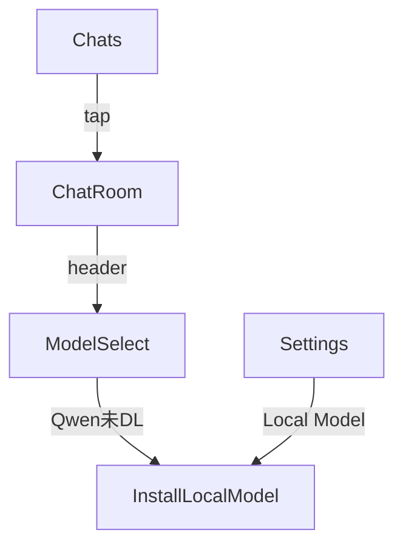

# 画面設計書（LINE風 + ローカルモデル 導線版）

## カラーパレット & テーマ
(primary `#005E36`, primary-light `#00C26A`, accent-blue `#007AFF`)

---

## 1. 画面一覧
| ID | 画面 | コンポーネント・要点 |
|----|------|--------------------|
| Splash | ロゴ＋Lottie | 2 s |
| Chats | トーク一覧 FlatList / 未読バッジ / ギア設定 | 長押し編集 |
| NewChat | Suggestion Chips + Input | `/imagine` ボタン |
| Notes | NoteList / Editor | MD/Text切替 |
| ChatRoom | Header: Model▼ + Avatar<br>MessageList + Input | Header tap → ModelSelect |
| ModelSelect (Modal) | モデル RadioList + **Qwen3 StateBadge** | タップで選択／未DLなら InstallModal |
| InstallLocalModel (Modal) | Qwen3 DL 確認 → ProgressBar | 完了バナー |
| ImageGen (Modal) | Prompt / Size / Generate | |
| Settings | Profile / Theme / Plan / **Local Model 管理** | DL・削除 |
| Subscription | プランカード・購入 | |
| PayWall | 上限→課金誘導 | |
| AuthModal | Apple/Google/Email OTP | |

---

## 2. ModelSelect 詳細 UI
```
Qwen3:4B (ローカル)   [⚪️ 未DL]  ▸
```
- バッジ: ⚪️未DL / 🔄DL中 / 🟢使用可  
- 未DLタップ → InstallLocalModel

---

## 3. InstallLocalModel フロー
```
┌────────────────────────────┐
│ Qwen 3‑4B をインストール？  │
│ サイズ: 10GB / Wi‑Fi 推奨 │
│ [キャンセル] [ダウンロード] │
│ ▓▓▓░░ 45 %                 │
└────────────────────────────┘
```

---

## 4. ナビゲーション

